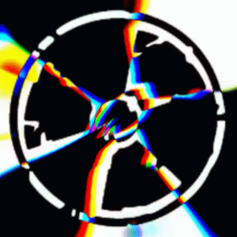

<div align="center">

# EmptyvisualZ

**Máquina de Glitch Visual em Tempo Real**
*Real-Time Visual Glitch Machine*

<br>

[](LICENSE)
[](#)
[](#)
[](#)

<br>

> *"o erro digital pode ser um grande acerto"*
> — jah works ✦

<br>



<br>

**▶ Mais demos:**
[output1.webm](output1.webm) · [output2.webm](output2.webm) · [output3.webm](output3.webm)

</div>

---

## 🎨 O que é?

**EmptyvisualZ** é uma ferramenta gratuita e open source para gerar visuais psicodélicos e glitch art em tempo real, direto no navegador — sem instalar nada, sem servidor, sem dependências.

Combine filtros WebGL, manipule cores, distorções e moduladores ao vivo. Perfeito para **VJing**, **projeções artísticas**, **instalações interativas** e **exploração criativa de glitch art**.

---

**EmptyvisualZ** is a free, open-source tool for generating psychedelic visuals and glitch art in real time, directly in your browser — no install, no server, no dependencies.

Stack effects, manipulate colors, distortions and modulators live. Perfect for **VJing**, **art projections**, **interactive installations** and **creative glitch art exploration**.

---

## ⚡ Funcionalidades

| | |
|:---:|:---|
| 🔥 | **32+ Efeitos WebGL** — Mirrors, warps, anomalias e filtros, todos acumuláveis no Stack Ativo |
| 🎨 | **22 Mapas Cromáticos** — Phosphor Verde, Thermal, Rainbow Prism, e muito mais |
| 🎮 | **Suporte a Gamepad** — Xbox, PlayStation e genéricos via Gamepad API |
| 📹 | **Upload de Vídeo** — MP4, WebM e outros formatos suportados pelo navegador |
| 🖼️ | **Upload de Imagem** — PNG, JPG como fonte de fundo ou overlay |
| 🧩 | **Overlay & Blend Modes** — Mescle uma segunda imagem em tempo real com múltiplos modos |
| 📐 | **Aspect Ratio & Rotação** — 16:9, 9:16, 1:1, 4:3, flip e rotação ao vivo |
| 📷 | **Webcam** — Captura de câmera ao vivo diretamente no browser |
| ✍️ | **Texto Sobreposto** — Injete texto com fonte, cor, glow e blink |
| 🔴 | **Gravação WebM** — Grave suas performances direto em vídeo |
| 📸 | **Captura de Frame** — Salve qualquer frame como PNG instantaneamente |
| 📺 | **Fullscreen & Popout** — Tela cheia limpa ou janela destacada pra segundo monitor |
| 🌐 | **PT / EN** — Interface bilíngue completa |
| 📱 | **Mobile** — Layout responsivo, funciona no celular |

---

## 🚀 Como usar

### Online — sem instalar nada

```
https://emptyvisuals.vercel.app/
```

### Local

```bash
git clone https://github.com/s4bedoriaocult4/emptyvisuals.git
cd emptyvisuals
npx serve .
# abre http://localhost:3000
```

> ⚠️ Abrir o `index.html` diretamente como `file://` pode bloquear Webcam e uploads por restrição de CORS. Use um servidor local ou o deploy online.

---

## ⌨️ Atalhos de Teclado

| Tecla | Efeito |
|:---:|:---|
| `Q W E R T Y U` | RGB / Scan / Slice / Edge / Noise / Pixel / Invert |
| `I O` | Kaleidoscope 4x / 8x |
| `A S D F` | Mirrors (X, Y, Quad, Diagonal) |
| `P` | Acid Warp |
| `1 – 9, 0, -, =` | Mapas cromáticos diretos |
| `Espaço` | Limpa todos os filtros |
| `Enter` | Stack aleatório de efeitos |
| `↑ ↓ ← →` | Pan X/Y do feed |
| `[ / ]` | Zoom |
| `PgUp / PgDn` | Blur |

---

## 🎮 Controle / Gamepad

| Botão | Ação |
|:---:|:---|
| `A` | Acid Warp |
| `B` | Kaleidoscope 4x |
| `X` | Datamosh |
| `Y` | Kaleidoscope 8x |
| `LB / RB` | Navega mapas cromáticos |
| `LT / RT` | Escurece / Clareia |
| `D-Pad` | Scan / Edge / RGB / Slice |
| `L-Stick` | Pan XY |
| `R-Stick` | Zoom / Hue Shift |
| `Select` | Limpa efeitos |
| `L3 + R3` | Reset total |

---

## 🛠️ Stack

- **HTML5 + CSS3 + Vanilla JS** — zero dependências externas
- **WebGL 1.0** — renderização GPU em tempo real (60fps)
- **MediaRecorder API** — gravação nativa do canvas
- **Gamepad API** — suporte a controles XInput/DirectInput

---

## 📁 Estrutura

```
emptyvisuals/
├── index.html      # aplicação completa (single file)
├── demo.mp4        # vídeo de demo padrão
├── output1.gif     # demo animado
├── output1.webm    # demo de efeito 1
├── output2.webm    # demo de efeito 2
├── output3.webm    # demo de efeito 3
├── LICENSE
└── README.md
```

---

## 🔒 Privacidade

Tudo roda localmente no seu navegador. Nenhum dado, vídeo ou imagem enviada vai para servidores externos. O processamento acontece inteiramente na sua GPU/CPU.

---

## ☕ Apoie

Se o projeto foi útil nas suas performances ou criações:

[](https://ko-fi.com/emptymtz)
[](https://instagram.com/empty.mtz)

---

## 📄 Licença

MIT — usa, modifica, distribui à vontade.

---

<div align="center">

*carar jah works* ✦

</div>
